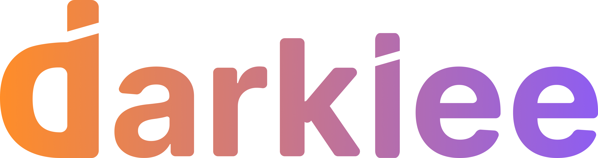

# Darkiee - Modern Single-Page Website

> **Where Technology Meets Vision**

A complete, modern, professional single-page website for Darkiee - a technology company specializing in web development, mobile apps, AI automation, cloud solutions, and digital branding.



## 🌟 Overview

This is a fully responsive, modern **single-page scrolling website** built with vanilla HTML5, CSS3, and JavaScript. The site features smooth scroll navigation, glassmorphism design, gradient accents, dark/light theme toggle, animations, and professional copywriting showcasing Darkiee's services and expertise.

**All content is on one page** - navigation uses smooth scrolling to different sections for a seamless, modern user experience.

## 📁 Site Structure

```
darkiee-website/
├── index.html              # Complete single-page website
│                           # Sections: Home, Services, About, Portfolio, Contact
│
├── css/
│   ├── style-modern.css    # Complete modern design system (1000+ lines)
│   └── bootstrap.min.css   # Bootstrap 5 (legacy support)
│
├── js/
│   ├── main-modern.js      # Interactive features + smooth scroll
│   └── main.js             # Legacy JavaScript
│
├── img/
│   ├── logo-new.png        # Modern Darkiee logo
│   ├── favicon.png         # Brand favicon
│   ├── deepak2.png         # Team member photo
│   ├── owner.jpeg          # CEO photo
│   ├── kapil.jpg           # Designer photo
│   └── [other images]
│
├── .github/
│   ├── workflows/
│   │   └── static.yml      # GitHub Pages auto-deployment
│   └── copilot-instructions.md  # AI agent guidelines
│
├── SINGLE-PAGE-CONVERSION.md   # Conversion guide & documentation
├── REDESIGN-README.md          # Original redesign docs
├── index-multipage-backup.html # Backup of multi-page version
└── README.md                   # This file
```

## 🎯 Page Sections

All sections are on **index.html** with smooth scroll navigation:

1. **Home (#home)** - Hero section with stats and value proposition
2. **Services (#services)** - 6 service cards (Web, Mobile, AI, Design, Cloud, Branding)
3. **Why Choose Darkiee** - 4 key differentiators
4. **Testimonials** - Client success stories
5. **About (#about)** - Company story, team, mission/vision
6. **Portfolio (#portfolio)** - 4 detailed case studies with results
7. **Contact (#contact)** - Quick contact methods, form, office info

## 🚀 Features

### 🎨 Design System

- **Modern Glassmorphism Effects**: Frosted glass cards with blur
- **Gradient Accents**: Purple-to-pink gradients (#6366F1 → #8B5CF6 → #EC4899)
- **Dark/Light Theme**: Toggle with localStorage persistence
- **CSS Custom Properties**: Centralized theming system
- **Responsive Design**: Mobile-first with breakpoints at 480px, 768px, 1024px

### 💫 Interactive Features

- **Smooth Scroll Navigation**: Anchor links with smooth scrolling
- **Intersection Observer Animations**: Elements fade in on scroll
- **Parallax Effects**: Subtle depth on hero section
- **Floating Card Animations**: Hover effects with transforms
- **Mobile Menu**: Responsive hamburger navigation
- **Scroll-to-Top Button**: Appears after scrolling down

### 📄 Pages

#### 1. **Homepage** (`index.html`)

- Animated hero section with gradient overlay
- 6 service cards with icons
- Why Choose Us section (4 pillars)
- 3 client testimonials
- Strong call-to-action section

#### 2. **Services** (`services.html`)

- **Web Development**: React, Next.js, Node.js, Django, Laravel
- **Mobile Apps**: React Native, Flutter, Swift, Kotlin
- **AI Automation**: Chatbots, ML models, RPA, NLP
- **UI/UX Design**: User research, prototyping, design systems
- **Cloud & DevOps**: AWS, Azure, Docker, Kubernetes, CI/CD
- **Product Branding**: Logo design, brand strategy, guidelines

Each service includes:

- Detailed feature list
- Technology stack
- Benefits and use cases
- Visual cards with icons

#### 3. **About** (`about.html`)

- Company origin story
- Mission & Vision statements
- 6 core values (Innovation, Partnership, Quality, etc.)
- Team showcase with 3 members (photos, roles, bios)
- Technology expertise grid (Frontend, Backend, Mobile, Cloud, AI, Databases)
- 6 reasons to choose Darkiee
- Stats: 150+ projects, 50+ clients, 15+ countries, 98% success rate

#### 4. **Portfolio** (`portfolio.html`)

- **4 Detailed Case Studies**:

  1. **E-commerce Automation** (Fashion Retailer)

     - React + Node.js platform
     - 80% faster processing, 3x sales growth

  2. **AI Chatbot** (Fintech Startup)

     - OpenAI + Rasa framework
     - 70% queries automated, $50K annual savings

  3. **Logistics Tracking App** (Supply Chain)

     - React Native mobile app
     - 40% faster deliveries, 4.8★ rating

  4. **AWS Cloud Migration** (SaaS Platform)
     - Kubernetes infrastructure
     - 99.9% uptime, 60% cost reduction

Each case study includes:

- Challenge description
- Solution approach
- Measurable results
- Technologies used

#### 5. **Contact** (`contact.html`)

- **3 Quick Contact Methods**:
  - WhatsApp: +91 93998 11283 (instant chat)
  - Email: info@darkiee.com
  - Phone: +91 93998 11283
- **Contact Form** with fields:
  - Name, Email, Phone
  - Service selection dropdown
  - Budget range
  - Project details textarea
  - Form validation with JavaScript
  - Success message with WhatsApp redirect option
- **Business Information**:
  - Location: Sector-B, Suryadev Nagar, Indore, MP
  - Business hours: Mon-Sat, 9 AM - 7 PM IST
  - Social media links
- **FAQ Section** (6 common questions):
  - Pricing information
  - Project timelines
  - Ongoing support
  - Team collaboration
  - Technology stack
  - NDA policies

## 🎨 Design System

### Color Palette

```css
/* Primary Colors */
--primary: #6366f1; /* Indigo - main brand color */
--secondary: #8b5cf6; /* Purple - secondary accent */
--accent: #ec4899; /* Pink - highlight color */

/* Neutral Colors */
--dark: #0f172a; /* Dark background */
--dark-lighter: #1e293b; /* Card backgrounds */
--light: #f8fafc; /* Light background */
--text-dark: #334155; /* Dark mode text */
--text-light: #e2e8f0; /* Light mode text */

/* Gradients */
--gradient: linear-gradient(135deg, #6366f1 0%, #8b5cf6 50%, #ec4899 100%);
```

### Typography

- **Primary Font**: Poppins (headings) - 300, 400, 500, 600, 700, 800
- **Secondary Font**: Inter (body text) - 300, 400, 500, 600, 700
- **Font Sizes**:
  - h1: 3.5rem (mobile: 2.5rem)
  - h2: 2.5rem (mobile: 2rem)
  - Body: 1rem
  - Small: 0.875rem

### Responsive Breakpoints

```css
/* Mobile First */
@media (min-width: 480px) {
  /* Small phones */
}
@media (min-width: 768px) {
  /* Tablets */
}
@media (min-width: 1024px) {
  /* Desktops */
}
@media (min-width: 1280px) {
  /* Large screens */
}
```

## 🛠️ Technologies Used

### Frontend

- **HTML5**: Semantic markup, accessibility features
- **CSS3**: Custom properties, flexbox, grid, animations
- **JavaScript ES6+**: Modern vanilla JS, no frameworks
- **Font Awesome 6.4.0**: Icon library
- **Google Fonts**: Poppins & Inter

### Deployment

- **GitHub Pages**: Static site hosting
- **GitHub Actions**: Automated deployment on push to `master`
- **Custom Domain**: darkiee.com (via CNAME)

### Performance

- **Lazy Loading**: Images load on scroll
- **CSS Minification**: Production-ready stylesheets
- **Preconnect Hints**: Google Fonts optimization
- **Mobile-First Design**: Optimized for all devices

## 📊 SEO & Analytics

### Meta Tags (All Pages)

```html
<meta name="description" content="Page-specific description" />
<meta name="keywords" content="Relevant, Keywords, Here" />
<meta name="author" content="Deepak Patidar" />
```

### Structured Data

- Business name: Darkiee
- Location: Indore, Madhya Pradesh, India
- Contact: info@darkiee.com, +91 93998 11283
- Social: Instagram (@team\_\_darkiee)

### Sitemap

Located at `sitemap.xml` - submitted to search engines

## 🚀 Deployment

### GitHub Pages (Automatic)

Website auto-deploys when you push to `master` branch:

```bash
git add .
git commit -m "Update website"
git push origin master
```

GitHub Actions workflow (`.github/workflows/static.yml`) handles deployment automatically.

### Local Development

1. **Clone the repository**:

```bash
git clone https://github.com/iamdarkiee/darkiee-website.git
cd darkiee-website
```

2. **Start local server**:

```bash
# Python
python -m http.server 8000

# Node.js
npx serve .

# PHP
php -S localhost:8000
```

3. **Open browser**:

```
http://localhost:8000
```

## 📝 Content Management

### Updating Contact Information

Contact details appear in 3 locations per page:

1. **Topbar** (if present)
2. **Footer** "Get In Touch" section
3. **Contact page** body content

Update in all locations to maintain consistency.

### Adding Team Members

Edit `about.html` → Team Section:

```html
<div class="team-card">
  <div class="team-image">
    
    <div class="team-social">
      <!-- Social links -->
    </div>
  </div>
  <div class="team-info">
    <h3>Name</h3>
    <p class="team-role">Role</p>
    <p class="team-bio">Bio text...</p>
  </div>
</div>
```

### Adding Portfolio Projects

Edit `portfolio.html` and follow existing case study structure with:

- Case tag (project type)
- Challenge description
- Solution list
- Results grid with metrics
- Tech stack badges

### Modifying Services

Edit `services.html` → Each service follows this pattern:

- Service tag
- Headline with gradient
- Lead paragraph
- Feature list (4 items)
- Tech stack badges
- Visual card

## 🎯 Brand Guidelines

### Logo Usage

- **Primary Logo**: `img/logo-new.png` (transparent background)
- **Favicon**: `img/favicon.png`
- **Minimum Size**: 50px width
- **Clear Space**: Logo width × 0.25 on all sides

### Color Usage

- **Primary Gradient**: Use for CTAs, headings, accents
- **Dark Theme**: Default for modern tech aesthetic
- **Light Theme**: Available via toggle for accessibility

### Voice & Tone

- **Professional yet approachable**
- **Action-oriented** (Start, Build, Transform)
- **Results-focused** (measurable outcomes)
- **Tech-savvy** (modern terminology)

## 🔧 Customization Guide

### Changing Brand Colors

Edit `css/style-modern.css` → `:root` section:

```css
:root {
  --primary: #YOUR_COLOR;
  --secondary: #YOUR_COLOR;
  --accent: #YOUR_COLOR;
}
```

### Modifying Animations

Edit `js/main-modern.js`:

- Scroll animations: `setupScrollAnimations()`
- Parallax effects: `setupParallax()`
- Intersection Observer: `IntersectionObserver` configuration

### Adding New Pages

1. Copy structure from existing page (e.g., `about.html`)
2. Update page title and meta tags
3. Add navigation link in navbar across all pages
4. Update footer links
5. Add to `sitemap.xml`

## 📱 Social Media Integration

### Active Channels

- **Instagram**: [@team\_\_darkiee](https://www.instagram.com/team__darkiee)
- **WhatsApp**: +91 93998 11283
- **Email**: info@darkiee.com

### Future Channels

LinkedIn, Twitter, GitHub links are placeholders in footer - update with actual URLs when accounts are created.

## 🐛 Known Issues & Fixes

### Fixed in This Version

✅ `<butaton>` typo → `<button>` (10 files)
✅ Email inconsistencies → `info@darkiee.com`
✅ Duplicate JavaScript properties removed
✅ Responsive design improvements
✅ Theme toggle persistence

### Future Enhancements

- [ ] Blog section with CMS integration
- [ ] Client portal/login area
- [ ] Live chat widget integration
- [ ] Multilingual support (Hindi, English)
- [ ] Backend for contact form (currently client-side)

## 📞 Support & Contact

**For website technical support**:

- Developer: Deepak Patidar
- Email: info@darkiee.com
- Phone: +91 93998 11283

**For business inquiries**:

- Email: info@darkiee.com
- WhatsApp: +91 93998 11283
- Website: [darkiee.com](https://darkiee.com)

## 📄 License

Copyright © 2025 Darkiee. All rights reserved.

---

**Built with ❤️ by the Darkiee Team**

_Last Updated: January 2025_
